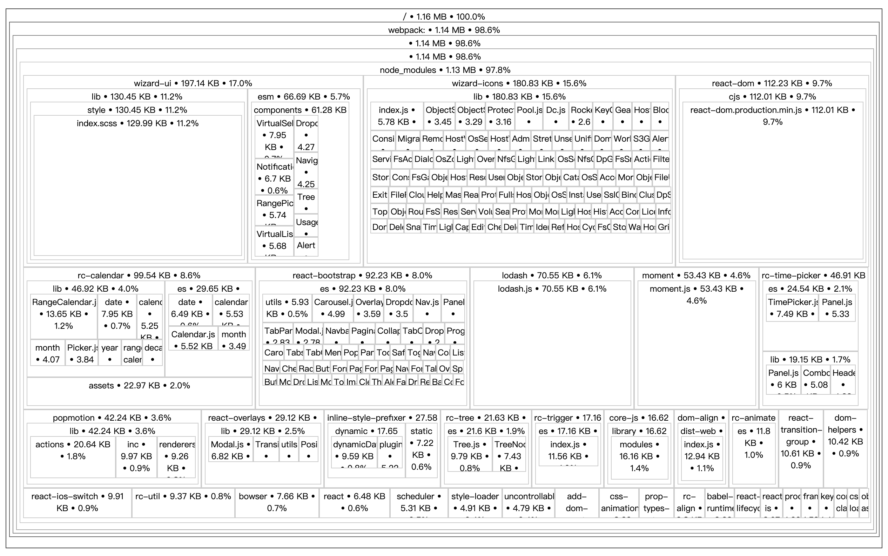

# 分析打包文件

## 使用 `source-map-explorer` 分析打包后的文件，安装

```bash
yarn add source-map-explorer -D
```

## 添加分析脚本, `dist` 是打包目录

```json
"scripts": {
    "analyze": "source-map-explorer 'dist/*.js'"
  },
```

## 执行脚本，并分析


